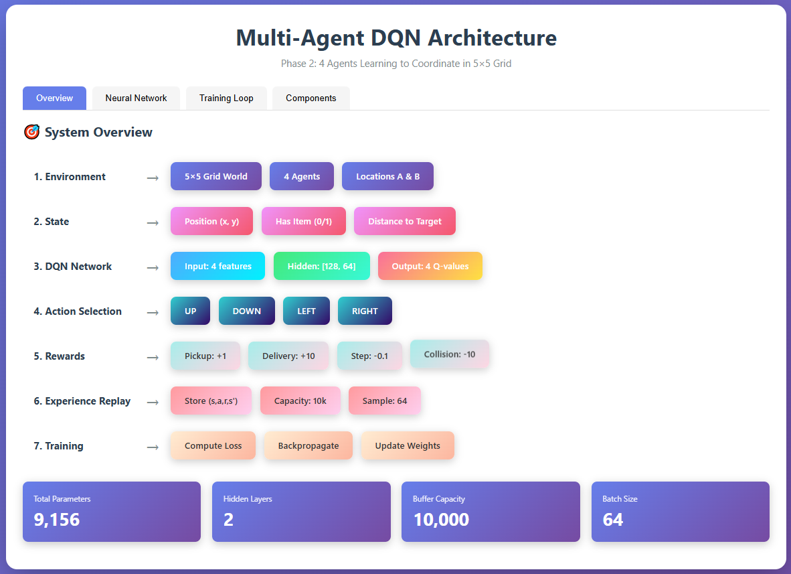
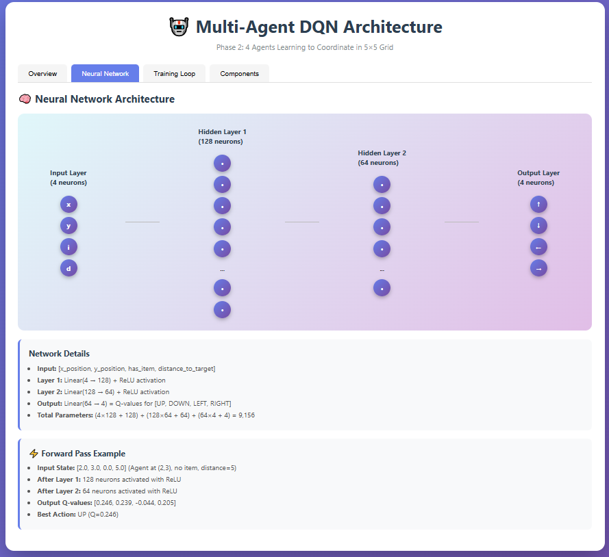
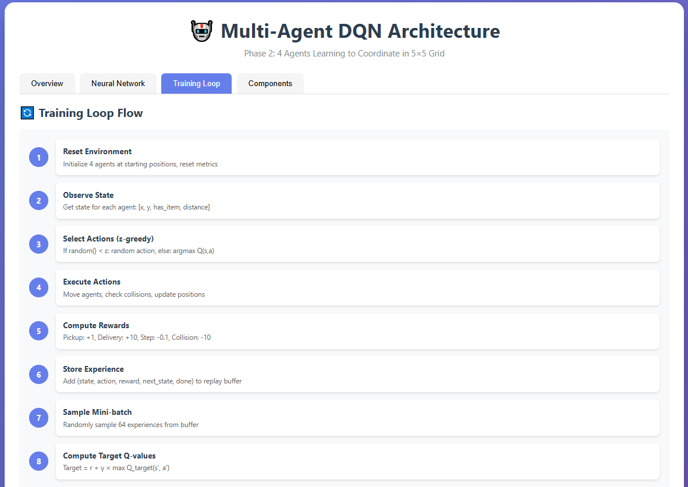
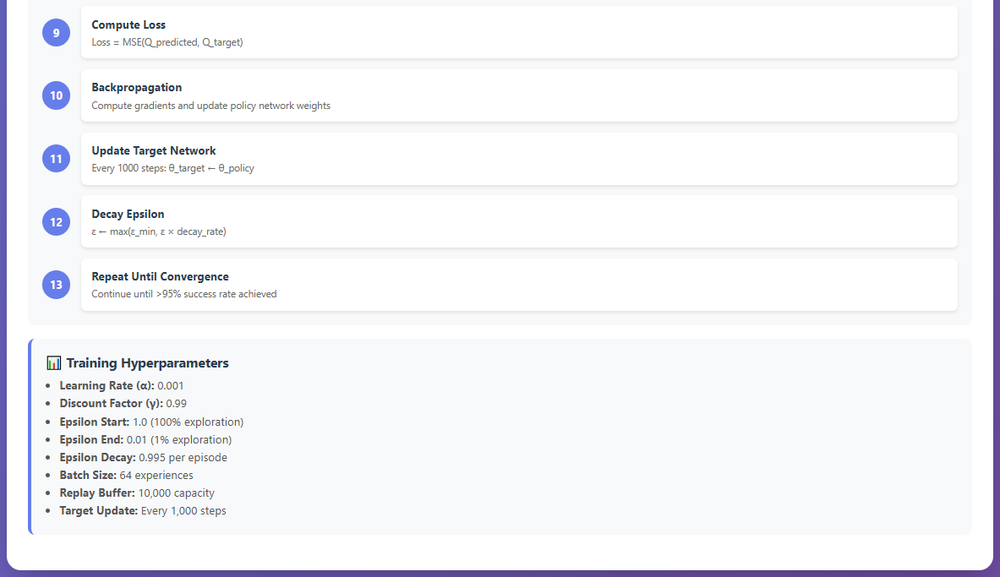
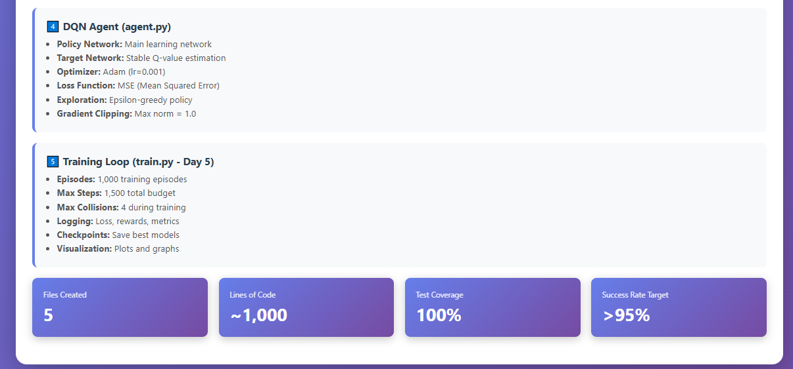

# Multi-Agent DQN Coordination

Phase 2: Multi-Agent Deep Q-Learning

## Task
Train 4 agents to shuttle items from location A to B in a 5x5 grid while avoiding collisions.

## Setup
```bash
pip install -r requirements.txt
```

## Run
```bash
python src/environment.py
```

## Project Structure
- `src/environment.py` - Grid world environment
- `src/agent.py` - DQN agent implementation (Day 4)
- `src/dqn.py` - Neural network (Day 4)
- `src/train.py` - Training loop (Day 5-6)

## Performance Targets
- >95% deliveries completed
- <500 collisions during training
- <20 steps per delivery

# Multi-Agent DQN Architecture
## Phase 2: 4 Agents Learning to Coordinate in 5×5 Grid






